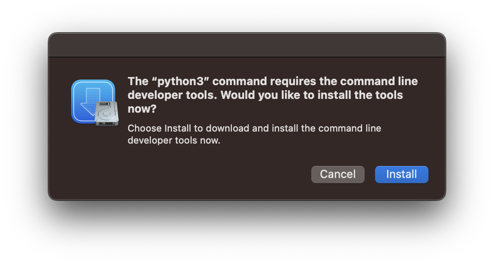

# Configuración de macOS

## Instalación de brew

`brew` es un manejador de paquetes.
cask applicaciones graficas

> [!WARNING]  
> [brew](https://brew.sh/) instalara `the command line developer tools`.

```shell
/bin/bash -c "$(curl -fsSL https://raw.githubusercontent.com/Homebrew/install/HEAD/install.sh)"
```

```console
==> Checking for `sudo` access (which may request your password)...
Password:
==> This script will install:
/opt/homebrew/bin/brew
/opt/homebrew/share/doc/homebrew
/opt/homebrew/share/man/man1/brew.1
/opt/homebrew/share/zsh/site-functions/_brew
/opt/homebrew/etc/bash_completion.d/brew
/opt/homebrew
/etc/paths.d/homebrew
==> The following new directories will be created:
/opt/homebrew/bin
/opt/homebrew/etc
/opt/homebrew/include
/opt/homebrew/lib
/opt/homebrew/sbin
/opt/homebrew/share
/opt/homebrew/var
/opt/homebrew/opt
/opt/homebrew/share/zsh
/opt/homebrew/share/zsh/site-functions
/opt/homebrew/var/homebrew
/opt/homebrew/var/homebrew/linked
/opt/homebrew/Cellar
/opt/homebrew/Caskroom
/opt/homebrew/Frameworks
==> The Xcode Command Line Tools will be installed.

Press RETURN/ENTER to continue or any other key to abort:
==> /usr/bin/sudo /usr/bin/install -d -o root -g wheel -m 0755 /opt/homebrew
==> /usr/bin/sudo /bin/mkdir -p /opt/homebrew/bin /opt/homebrew/etc /opt/homebrew/include /opt/homebrew/lib /opt/homebrew/sbin /opt/homebrew/share /opt/homebrew/var /opt/homebrew/opt /opt/homebrew/share/zsh /opt/homebrew/share/zsh/site-functions /opt/homebrew/var/homebrew /opt/homebrew/var/homebrew/linked /opt/homebrew/Cellar /opt/homebrew/Caskroom /opt/homebrew/Frameworks
==> /usr/bin/sudo /bin/chmod ug=rwx /opt/homebrew/bin /opt/homebrew/etc /opt/homebrew/include /opt/homebrew/lib /opt/homebrew/sbin /opt/homebrew/share /opt/homebrew/var /opt/homebrew/opt /opt/homebrew/share/zsh /opt/homebrew/share/zsh/site-functions /opt/homebrew/var/homebrew /opt/homebrew/var/homebrew/linked /opt/homebrew/Cellar /opt/homebrew/Caskroom /opt/homebrew/Frameworks
==> /usr/bin/sudo /bin/chmod go-w /opt/homebrew/share/zsh /opt/homebrew/share/zsh/site-functions
==> /usr/bin/sudo /usr/sbin/chown gil /opt/homebrew/bin /opt/homebrew/etc /opt/homebrew/include /opt/homebrew/lib /opt/homebrew/sbin /opt/homebrew/share /opt/homebrew/var /opt/homebrew/opt /opt/homebrew/share/zsh /opt/homebrew/share/zsh/site-functions /opt/homebrew/var/homebrew /opt/homebrew/var/homebrew/linked /opt/homebrew/Cellar /opt/homebrew/Caskroom /opt/homebrew/Frameworks
==> /usr/bin/sudo /usr/bin/chgrp admin /opt/homebrew/bin /opt/homebrew/etc /opt/homebrew/include /opt/homebrew/lib /opt/homebrew/sbin /opt/homebrew/share /opt/homebrew/var /opt/homebrew/opt /opt/homebrew/share/zsh /opt/homebrew/share/zsh/site-functions /opt/homebrew/var/homebrew /opt/homebrew/var/homebrew/linked /opt/homebrew/Cellar /opt/homebrew/Caskroom /opt/homebrew/Frameworks
==> /usr/bin/sudo /usr/sbin/chown -R gil:admin /opt/homebrew
==> Searching online for the Command Line Tools
==> /usr/bin/sudo /usr/bin/touch /tmp/.com.apple.dt.CommandLineTools.installondemand.in-progress
==> Installing Command Line Tools for Xcode-16.4
==> /usr/bin/sudo /usr/sbin/softwareupdate -i Command\ Line\ Tools\ for\ Xcode-16.4
Software Update Tool

Finding available software

Downloading Command Line Tools for Xcode
Downloaded Command Line Tools for Xcode
Installing Command Line Tools for Xcode
Done with Command Line Tools for Xcode
Done.
==> /usr/bin/sudo /usr/bin/xcode-select --switch /Library/Developer/CommandLineTools
==> /usr/bin/sudo /bin/rm -f /tmp/.com.apple.dt.CommandLineTools.installondemand.in-progress
==> Downloading and installing Homebrew...
remote: Enumerating objects: 316801, done.
remote: Counting objects: 100% (178/178), done.
remote: Compressing objects: 100% (115/115), done.
remote: Total 316801 (delta 95), reused 109 (delta 63), pack-reused 316623 (from 3)
remote: Enumerating objects: 55, done.
remote: Counting objects: 100% (34/34), done.
remote: Total 55 (delta 34), reused 34 (delta 34), pack-reused 21 (from 1)
==> /usr/bin/sudo /bin/mkdir -p /etc/paths.d
==> /usr/bin/sudo tee /etc/paths.d/homebrew
/opt/homebrew/bin
==> /usr/bin/sudo /usr/sbin/chown root:wheel /etc/paths.d/homebrew
==> /usr/bin/sudo /bin/chmod a+r /etc/paths.d/homebrew
==> Updating Homebrew...
==> Downloading https://ghcr.io/v2/homebrew/core/portable-ruby/blobs/sha256:c6946ba2c387b47934e77c352c2056489421003ec7ddb2abf246cef2168ec140
#################################################################################################################################################################### 100.0%
==> Pouring portable-ruby-3.4.7.arm64_big_sur.bottle.tar.gz
==> Installation successful!

==> Homebrew has enabled anonymous aggregate formulae and cask analytics.
Read the analytics documentation (and how to opt-out) here:
  https://docs.brew.sh/Analytics
No analytics data has been sent yet (nor will any be during this install run).

==> Homebrew is run entirely by unpaid volunteers. Please consider donating:
  https://github.com/Homebrew/brew#donations

==> Next steps:
- Run these commands in your terminal to add Homebrew to your PATH:
    echo >> /Users/gil/.zprofile
    echo 'eval "$(/opt/homebrew/bin/brew shellenv)"' >> /Users/gil/.zprofile
    eval "$(/opt/homebrew/bin/brew shellenv)"
- Run brew help to get started
- Further documentation:
    https://docs.brew.sh
```

```shell
echo >> /Users/gil/.zprofile
echo 'eval "$(/opt/homebrew/bin/brew shellenv)"' >> /Users/gil/.zprofile
eval "$(/opt/homebrew/bin/brew shellenv)"
```

## iTerm2

```shell
brew install --cask  iterm2
```
## Firefox

```shell
brew install --cask firefox@developer-edition
```

```shell
brew install --cask firefox
```

Para cambiar el idioma de `Firefox` a español:

- Abrir `Firefox`.
- En la barra de menú, da clic en `Firefox` y selecciona `settings`.
- En el panel `General` ve a la sección de `Language`.
- En el menú da clic en la opción `Search for more languages`.
- Selecciona `Español (MX)` y da clic en el botón `Add`.
- Mueve `Español` a la primera posición de la lista.
- Reinicia `Firefox`

## Visual Studio Code

```shell
brew install --cask visual-studio-code
```
Ver [Visual Studio Code](vscode)

## Git
```shell
brew install git
```

```console
==> Installing git
==> Pouring git--2.52.0.arm64_sequoia.bottle.tar.gz
==> Caveats
The Tcl/Tk GUIs (e.g. gitk, git-gui) are now in the `git-gui` formula.
Subversion interoperability (git-svn) is now in the `git-svn` formula.
==> Summary
🍺  /opt/homebrew/Cellar/git/2.52.0: 1,718 files, 59.8MB
==> Running `brew cleanup git`...
Disable this behaviour by setting `HOMEBREW_NO_INSTALL_CLEANUP=1`.
Hide these hints with `HOMEBREW_NO_ENV_HINTS=1` (see `man brew`).
==> Caveats
zsh completions and functions have been installed to:
  /opt/homebrew/share/zsh/site-functions
==> git
The Tcl/Tk GUIs (e.g. gitk, git-gui) are now in the `git-gui` formula.
Subversion interoperability (git-svn) is now in the `git-svn` formula.
```

## Configurando Git por primera vez
https://git-scm.com/book/es/v2/Inicio---Sobre-el-Control-de-Versiones-Configurando-Git-por-primera-vez

https://git-scm.com/book/en/v2/Getting-Started-First-Time-Git-Setup

Lo primero que deberás hacer cuando instales Git es establecer tu nombre de usuario y dirección de correo electrónico.

```shell
git config --global user.name "John Doe"
```

```shell
git config --global user.email "johndoe@example.com"
```

## Configuración básica del cliente
https://git-scm.com/book/es/v2/Personalizaci%C3%B3n-de-Git-Configuraci%C3%B3n-de-Git

https://git-scm.com/book/sv/v2/Customizing-Git-Git-Configuration

puedes elegir el editor de texto por defecto que se utilizará cuando Git necesite que introduzcas un mensaje
```shell
git config --global core.editor nano
```

## Git Alias
https://git-scm.com/book/es/v2/Fundamentos-de-Git-Alias-de-Git

https://git-scm.com/book/en/v2/Git-Basics-Git-Aliases

Si no quieres teclear el nombre completo de cada comando de Git, puedes establecer fácilmente un alias
```shell
git config --global alias.st status
```
```shell
git config --global alias.co checkout
```
```shell
git config --global alias.ci commit
```

`.gitconfig`

```shell
# This is Git's per-user configuration file.
[user]
  name = Firstname Lastname
  email = email@gmail.com
# misc settings
[core]
  # set your prefered editor
  editor = nano
  excludesfile = ~/.gitignore
# pretty colors, yay!
[color]
  ui = auto
# from Calvin Hendryx-Parker dotfile
[color "branch"]
  current = yellow reverse
  local = yellow
  remote = green
[color "diff"]
  whitespace = red reverse
  meta = yellow
  frag = magenta
  old = red
  new = green
[color "status"]
  added = yellow
  changed = green
  untracked = cyan
[alias]
# Status helpers
  st = status -sb
  stu = status -s -uno
  stl = status --long
# Commit shortcuts and verbosity
  ci = commit
  co = checkout
[github]
  user = username
```

## Comprobando tu Configuración

Si quieres comprobar tu configuración, puedes usar el comando git config --list para mostrar todas las propiedades que Git ha configurado:

```shell
git config --list 
```

# GitHub

## Revisar las llaves SSH existentes

Lista los archivos en tu directorio .ssh

```shell
ls -la ~/.ssh
```

## Genera una nueva llave SSH

Genereamos la nueva llave.

```shell
$ ssh-keygen -t ed25519 -C "your_email@example.com"
Generating public/private ed25519 key pair.
Enter file in which to save the key (/Users/you/.ssh/id_ed25519):
Enter passphrase (empty for no passphrase):
Enter same passphrase again:
Your identification has been saved in /Users/you/.ssh/id_ed25519
Your public key has been saved in /Users/you/.ssh/id_ed25519.pub
```

Inicia el ssh-agente en segundo plano

```shell
$ eval "$(ssh-agent -s)"
Agent pid 10815
```

Modificamos el archivo ~/.ssh/config para cargar las llaves de manera automatica al ssh-agent y almancenar las frases de contraseñas en el llavero.

Si no exte el archivo lo creamos

```shell
$ touch ~/.ssh/config
```

Modificamos el archivo con las siguientes lineas:

```shell
Host github.com
  AddKeysToAgent yes
  UseKeychain yes
  IdentityFile ~/.ssh/id_ed25519
```

Agregamos nuestra llave privada al ssh-agent y guardamos la frases de contraseñas en el llavero.

```shell
$ ssh-add --apple-use-keychain ~/.ssh/id_ed25519
Enter passphrase for /Users/you/.ssh/id_ed25519:
Identity added: /Users/you/.ssh/id_ed25519 (your_email@example.com)
```

Agregamos la llave publica a GitHub 

Copiamos la llave publica

```shell
pbcopy < ~/.ssh/id_ed25519.pub
```

agregamos una llave nueva en https://github.com/settings/keys y pegamos la llave publica.

Probamos la conección y verificamos que la huella coincida con alguna de las [huellas de github](https://docs.github.com/en/authentication/keeping-your-account-and-data-secure/githubs-ssh-key-fingerprints)

```shell
ssh -T git@github.com
The authenticity of host 'github.com (IP)' can't be established.
ED25519 key fingerprint is SHA256:+DiY3wvvV6TuJJhbpZisF/zLDA0zPMSvHdkr4UvCOqU.
This key is not known by any other names
Are you sure you want to continue connecting (yes/no/[fingerprint])? yes
```

## GitHub CLI
```sh
brew install gh
```

```sh
gh auth login
? What account do you want to log into? GitHub.com
? What is your preferred protocol for Git operations? HTTPS
? Authenticate Git with your GitHub credentials? Yes
? How would you like to authenticate GitHub CLI? Paste an authentication token
Tip: you can generate a Personal Access Token here https://github.com/settings/tokens
The minimum required scopes are 'repo', 'read:org', 'workflow'.
? Paste your authentication token: ****************************************
- gh config set -h github.com git_protocol https
✓ Configured git protocol
✓ Logged in as login-name
```

```sh
gh auth logout
gh auth login --with-token < mytoken.txt
gh auth status
```

https://cli.github.com/manual/


# Python

> [!NOTE]  
> macOS Ventura elimino `python`.
> Sí lo necesitas debes ejecutar `python3` que instalara `the command line developer tools`.



> [!NOTE]
> [Si tienes problemas con CLT](https://mac.install.guide/commandlinetools/3.html)


Antes de installar python debemos instalar varios modulos si queremos tenerlos disponibles.

```shell
brew info python
```
```console
==> python@3.14: stable 3.14.1 (bottled)
Interpreted, interactive, object-oriented programming language
https://www.python.org/
Not installed
From: https://github.com/Homebrew/homebrew-core/blob/HEAD/Formula/p/python@3.14.rb
License: Python-2.0
==> Dependencies
Build: pkgconf ✔
Required: mpdecimal ✘, openssl@3 ✔, sqlite ✘, xz ✘, zstd ✘
==> Caveats
Python is installed as
  /opt/homebrew/bin/python3

Unversioned symlinks `python`, `python-config`, `pip` etc. pointing to
`python3`, `python3-config`, `pip3` etc., respectively, are installed into
  /opt/homebrew/opt/python@3.14/libexec/bin

`idle3.14` requires tkinter, which is available separately:
  brew install python-tk@3.14
```

> [!NOTE]
> Mac OS Monterrey: gdbm ✔, mpdecimal ✘, openssl@1.1 ✘, readline ✔, sqlite ✔, xz ✔

```shell
# Install python build deps
brew install mpdecimal sqlite xz zstd
```

## openssl

```console
brew install openssl
==> Caveats
==> openssl@3
A CA file has been bootstrapped using certificates from the system
keychain. To add additional certificates, place .pem files in
  /opt/homebrew/etc/openssl@3/certs

and run
  /opt/homebrew/opt/openssl@3/bin/c_rehash
```

## readline
readline es una biblioteca para edición de linea de comandos

```console
brew install readline
==> Caveats
==> readline
readline is keg-only, which means it was not symlinked into /opt/homebrew,
because macOS provides BSD libedit.

For compilers to find readline you may need to set:
  export LDFLAGS="-L/opt/homebrew/opt/readline/lib"
  export CPPFLAGS="-I/opt/homebrew/opt/readline/include"
```

## sqlite
Interface para SQLite
```console
brew install sqlite
==> Caveats
==> sqlite
sqlite is keg-only, which means it was not symlinked into /opt/homebrew,
because macOS already provides this software and installing another version in
parallel can cause all kinds of trouble.

If you need to have sqlite first in your PATH, run:
  echo 'export PATH="/opt/homebrew/opt/sqlite/bin:$PATH"' >> ~/.zshrc

For compilers to find sqlite you may need to set:
  export LDFLAGS="-L/opt/homebrew/opt/sqlite/lib"
  export CPPFLAGS="-I/opt/homebrew/opt/sqlite/include"
```

## xz
xz es una biblioteca de compresssion de datos en particular nos interesa liblzma.

```shell
brew install xz
```

## gdbm
gdbm es necesario para usar el profiler de Zope (Control_Panel/DebugInfo)

```shell
brew install gdbm
```

## yaml
parser de YAML

```shell
brew install libyaml
```

## bzip2

```shell
brew install bzip2
```
```console
==> Fetching downloads for: bzip2
✔︎ Bottle Manifest bzip2 (1.0.8)                                                                                                               [Downloaded   12.8KB/ 12.8KB]
✔︎ Bottle bzip2 (1.0.8)                                                                                                                        [Downloaded  175.4KB/175.4KB]
==> Pouring bzip2--1.0.8.arm64_sequoia.bottle.2.tar.gz
==> Caveats
bzip2 is keg-only, which means it was not symlinked into /opt/homebrew,
because macOS already provides this software and installing another version in
parallel can cause all kinds of trouble.

If you need to have bzip2 first in your PATH, run:
  echo 'export PATH="/opt/homebrew/opt/bzip2/bin:$PATH"' >> ~/.zshrc

For compilers to find bzip2 you may need to set:
  export LDFLAGS="-L/opt/homebrew/opt/bzip2/lib"
  export CPPFLAGS="-I/opt/homebrew/opt/bzip2/include"
==> Summary
🍺  /opt/homebrew/Cellar/bzip2/1.0.8: 27 files, 529.6KB
==> Running `brew cleanup bzip2`...
Disable this behaviour by setting `HOMEBREW_NO_INSTALL_CLEANUP=1`.
Hide these hints with `HOMEBREW_NO_ENV_HINTS=1` (see `man brew`).
```

## openssl@1.1 para python 2.7.18

```shell
brew install openssl@1.1
```

```console
==> Fetching downloads for: openssl@1.1
Warning: openssl@1.1 has been deprecated because it is not supported upstream! It was disabled on 2024-11-11.
✔︎ Bottle Manifest openssl@1.1 (1.1.1w)                                                                                                        [Downloaded   11.2KB/ 11.2KB]
✔︎ Bottle openssl@1.1 (1.1.1w)                                                                                                                 [Downloaded    5.3MB/  5.3MB]
==> Pouring openssl@1.1--1.1.1w.arm64_sonoma.bottle.tar.gz
==> Caveats
A CA file has been bootstrapped using certificates from the system
keychain. To add additional certificates, place .pem files in
  /opt/homebrew/etc/openssl@1.1/certs

and run
  /opt/homebrew/opt/openssl@1.1/bin/c_rehash

openssl@1.1 is keg-only, which means it was not symlinked into /opt/homebrew,
because this is an alternate version of another formula.

If you need to have openssl@1.1 first in your PATH, run:
  echo 'export PATH="/opt/homebrew/opt/openssl@1.1/bin:$PATH"' >> ~/.zshrc

For compilers to find openssl@1.1 you may need to set:
  export LDFLAGS="-L/opt/homebrew/opt/openssl@1.1/lib"
  export CPPFLAGS="-I/opt/homebrew/opt/openssl@1.1/include"

For pkgconf to find openssl@1.1 you may need to set:
  export PKG_CONFIG_PATH="/opt/homebrew/opt/openssl@1.1/lib/pkgconfig"
==> Summary
🍺  /opt/homebrew/Cellar/openssl@1.1/1.1.1w: 8,102 files, 18.9MB
==> Running `brew cleanup openssl@1.1`...
Disable this behaviour by setting `HOMEBREW_NO_INSTALL_CLEANUP=1`.
Hide these hints with `HOMEBREW_NO_ENV_HINTS=1` (see `man brew`).
```

## Pillow

* **jpeg** biblioteca para manejo de imagenes JPEG
* **freetype** provee servicios de fuentes
* **libpng** biblioteca para manejo de imagenes PNG
* **libtiff** provee funcionalidad de compresión TIFF
* **little-cms2** provee manejo de color
* **openjpeg** biblioteca para manejo de imagenes JPEG-2000
* **tcl-tk** soporte para imagenes tkinter
* **webp** formato de compresssion sin perdidad para imagenes web
* **zlib** provee acceso a PNGs comprimidos
* **libxcb** provee soporte para X11

```shell
brew install jpeg freetype libpng libtiff little-cms2 openjpeg webp tcl-tk zlib
```
```shell
brew install libxcb
```
```shell
brew install libx11
```

```console
==> Caveats
==> jpeg
jpeg is keg-only, which means it was not symlinked into /opt/homebrew,
because it conflicts with `jpeg-turbo`.

If you need to have jpeg first in your PATH, run:
  echo 'export PATH="/opt/homebrew/opt/jpeg/bin:$PATH"' >> ~/.zshrc

For compilers to find jpeg you may need to set:
  export LDFLAGS="-L/opt/homebrew/opt/jpeg/lib"
  export CPPFLAGS="-I/opt/homebrew/opt/jpeg/include"

For pkg-config to find jpeg you may need to set:
  export PKG_CONFIG_PATH="/opt/homebrew/opt/jpeg/lib/pkgconfig"
==> zlib
zlib is keg-only, which means it was not symlinked into /opt/homebrew,
because macOS already provides this software and installing another version in
parallel can cause all kinds of trouble.

For compilers to find zlib you may need to set:
  export LDFLAGS="-L/opt/homebrew/opt/zlib/lib"
  export CPPFLAGS="-I/opt/homebrew/opt/zlib/include"

For pkg-config to find zlib you may need to set:
  export PKG_CONFIG_PATH="/opt/homebrew/opt/zlib/lib/pkgconfig"
```

## pyenv

```shell
brew info pyenv
```
```console
==> pyenv: stable 2.3.23 (bottled), HEAD
Python version management
https://github.com/pyenv/pyenv
Not installed
From: https://github.com/Homebrew/homebrew-core/blob/HEAD/Formula/pyenv.rb
License: MIT
==> Dependencies
Required: autoconf ✘, openssl@3 ✔, pkg-config ✘, readline ✔
```

```shell
brew install pyenv
```
```shell
brew install pyenv-virtualenv
```
```shell
==> Caveats
==> pyenv-virtualenv
To enable auto-activation add to your profile:
  if which pyenv-virtualenv-init > /dev/null; then eval "$(pyenv virtualenv-init -)"; fi
```

agregamos eso a nuestro .zshrc

```sh
# pyenv configuration for Zsh
export PYENV_ROOT="$HOME/.pyenv"
command -v pyenv >/dev/null || export PATH="$PYENV_ROOT/bin:$PATH"
eval "$(pyenv init -)"

# Enable auto-activation of virtualenvs 
if which pyenv-virtualenv-init > /dev/null; then 
  eval "$(pyenv virtualenv-init -)";
fi
```

```sh
pyenv install 2.7.18
pyenv install 3.9.17
pyenv install 3.11.9
pyenv global 3.11.9 2.7.18
pyenv versions

pyenv virtualenv 3.9.16 proj1-env
pyenv local proj1-env
pyenv virtualenv-delete proj1-env
pyenv uninstall 3.9.16
```

* [Troubleshooting / FAQ](https://github.com/pyenv/pyenv/wiki#suggested-build-environment)
* [ERROR: The Python zlib extension was not compiled](https://github.com/pyenv/pyenv/wiki/Common-build-problems#keg-only-homebrew-packages-are-forcibly-linked--added-to-path)

## pipx
```sh
brew install pipx
pipx install pls
pipx list
pipx ensurepath
```

```shell
pipx reinstall-all
```

```sh
# Created by `pipx` on 2022-12-06 15:32:16
export PATH="$PATH:/Users/gil/.local/bin"
```

```shell
# pipx configuration with pyenv
export PIPX_DEFAULT_PYTHON="$HOME/.pyenv/versions/3.11.9/bin/python"
```


# Buildout
Creamos en el home un directorio .buildout

```sh
mkdir -p .buildout/eggs
mkdir -p .buildout/downloads
mkdir -p .buildout/extends
touch .buildout/default.cfg
```
El archivo default.cfg debe contener algo como lo siguiente:

```sh
[buildout]
eggs-directory = /Users/username/.buildout/eggs
download-cache = /Users/username/.buildout/downloads
extends-cache = /Users/username/.buildout/extends

index = https://pypi.python.org/simple
socket-timeout = 3
```

## wv
wv permite el acceso a archivos de tipo Microsoft Word

```sh
brew install wv
```

## poppler

nos da las herramientas **pdftotext** y **pdftohtml**

```sh
brew install poppler
```


## Plone 4, 5

```sh
gh repo clone useer-name/plone-project
```

```sh
git clone plone-project
cd  plone-project
pyenv virtualenv 2.7.18 plone4.3
pyenv local plone4.3
pip install -r requirements.txt 
buildout
```


# Plone 6

```sh
mkdir my_project
cd my_project
pyenv virtualenv 3.10.10 plone6.0
```


```sh
pipx install cookiecutter
pipx install plonecli
pipx inject plonecli bobtemplates.plone
pipx list --include-injected
pipx install isort
pipx install tox
pipx install zpretty
```

```sh
brew install black
```


# Tools

A cat(1) clone with wings.

```sh
brew install bat
```


```shell
pipx install httpie
```

Linux/OSX/FreeBSD resource monitor 

```sh
pipx install bpytop
```

Pgcli es una interfaz en la linea de comandos para `Postgresql`
```shell
pipx install pgcli
```


## libpq

API en C para postgres

```sql
brew install libpq
# brew install libpq --build-from-source
```

# latex

Ver [$\LaTeX$](latex)

# Zen

```sh
brew install --cask zen-browser
```

# klogg

```sh
brew install --cask klogg
```

# Referencias
* [The Arctic Ice Studio Markdown Code Style.](https://arcticicestudio.github.io/styleguide-markdown/)
* [Connect with SSH.](https://docs.github.com/en/authentication/connecting-to-github-with-ssh)
