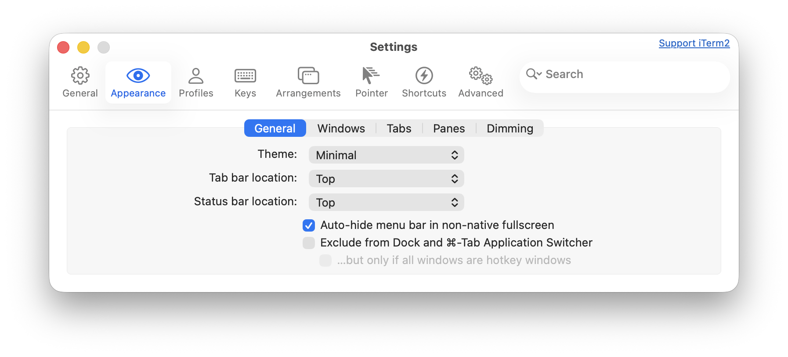
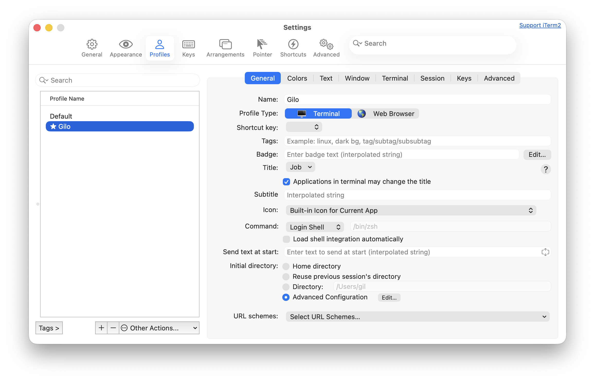
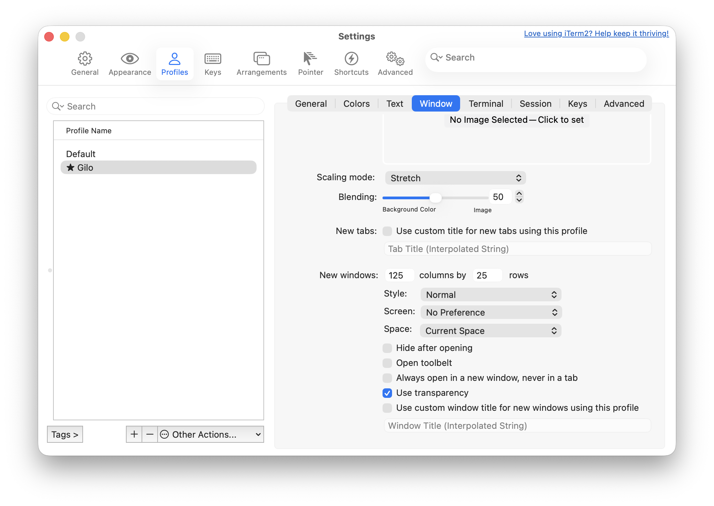
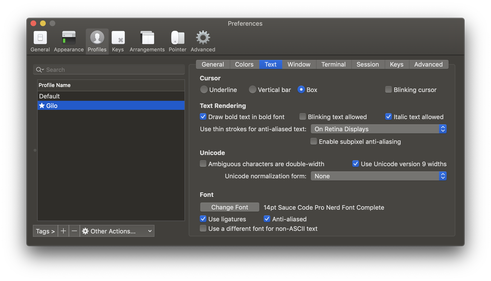

# iTerm2

[iTerm2](http://www.iterm2.com) es un remplazo de la Terminal de Apple.

## Instalación

```shell
brew install --cask  iterm2
```

| Teclas  | Descripción       |
| :---    | ---               |
| ⌘ ⏎     | pantalla completa |
| ⌘ D     | divide la terminal verticalmente |
| ⌘ ⇧ D   | divide la terminal horizontalmente |
| ⌘ ⌥ UP  |cambia de terminal |
| ⌘ /     | resalta la posición del cursos |

## Apariencia




## Ventanas y Pestañas

En [iTerm2](http://www.iterm2.com) podemos configurar en que directorio se abriran las nuevas ventanas o pestañas.




## Dimensiones de terminal




runs once at login for environment variables and settings inherited by all shells, while ~/.zshrc runs for every interactive shell (like new terminal tabs) for aliases, functions, prompts, and behaviors, loading after ~/.zprofile in a login session, making it ideal for day-to-day interactive use. Use zprofile for persistent PATH or EDITOR, and zshrc for aliases (ll), prompts (PS1), and interactive tweaks.


## Colores

> [!TIP]
> El archivo `.zprofile` se ejecuta una vez al inicio de sessión y se usa para configurar variables de ambiente y configuración heredada por todos las terminales.
> El archivo `.zshrc` se ejecuta para cada pestaña o ventana y se usa para personalizar el entorno de la terminal.

Para que `ls` liste los archivos y direcorios con colores se agrega al archivo `.zshrc`. 

```console
export CLICOLOR=1
```

## Tipo de letra

### Maple Mono

[Maple Mono](https://font.subf.dev/en/)

```shell
brew search font-maple
```

```shell
brew install --cask font-maple-mono-normal-nf
```

```shell
brew list --casks
```

En iTerm2 :menuselection:`Preferences --> Profiles --> Text` seleccionamos el tipo de letra.



Para probar algunos caracteres en la terminal:

```shell
echo "\ue0b0 \u00b1 \ue0a0 \u27a6 \u2718 \u26a1 \u2699"
```


### Source Code Pro

[Source Code Pro](https://github.com/adobe-fonts/source-code-pro) es un tipo de letra para programadores.

Se instala con brew

```shell
brew install --cask font-source-code-pro
```

## Nerd Fonts

`Nerd Fonts <http://nerdfonts.com>`_

```shell
brew install --cask font-fira-code-nerd-font
brew install --cask font-jetbrains-mono-nerd-font
brew list
```


## oh-my-posh

```shell
brew install oh-my-posh
```

Add the following to ~/.zshrc:

```shell
eval "$(oh-my-posh prompt init zsh)"
```

```shell
source ~/.zshrc
```

Salto de palabras
-----------------

En iterm2 selccionamos :menuselection:`Preferences --> Profiles --> Keys --> load preset --> Natural Text Editing`.

=== =================================================
⌘ → envia el cursos al inicio de la siguiente palabra
⌘   envia el cursos al inicio de la palabra anterior
=== =================================================


Python, Plone
-------------

Cuando iniciamos una instancia de Plone marca el error

```console
ValueError: unknown locale: UTF-8
```

Hay dos maneras de solucionar esto:

- agregar al archivo :file:`.bash_profile` o en el archivo :file:`.zprofile`

```console
# iTerm2 fix
export LC_ALL=en_US.UTF-8
export LANG=en_US.UTF-8
```

O en :menuselection:`Preferencias --> Perfil --> Terminal`  solicitar que no se asigne la variable de localización de manera automática (ver imagen)


.. image:: _static/item2_locale.png
   :alt: iTerm2 (Locale)
   :width: 80%


oh-my-zsh
---------

Instalamos `Oh My ZSH! <https://ohmyz.sh/>`_

.. code-block:: shell

    $ sh -c "$(curl -fsSL https://raw.github.com/robbyrussell/oh-my-zsh/master/tools/install.sh)"


Para actuzalizar a la ultima versión.

.. code-block:: shell

   $ omz update


Temas
-----

Editamos el archivo :file:`.zshrc` para definir el tema

.. code-block:: shell

    ZSH_THEME="agnoster"


Plugins
-------

git
~~~

Completa con tab los comandos de git

zsh-syntax-highlighting
~~~~~~~~~~~~~~~~~~~~~~~

.. code-block:: shell

   git clone https://github.com/zsh-users/zsh-syntax-highlighting.git "$ZSH_CUSTOM/plugins/zsh-syntax-highlighting"

.. code-block:: shell

   plugins = (
      colored-man-pages
      git
      pipenv
      python
      zsh-syntax-highlighting
   )

zsh-autosuggestions
~~~~~~~~~~~~~~~~~~~

.. code-block:: shell

   git clone https://github.com/zsh-users/zsh-autosuggestions "$ZSH_CUSTOM/plugins/zsh-autosuggestions"

.. code-block:: shell

   plugins = (
      git
      zsh-autosuggestions
   )


zsh-history-substring-search
~~~~~~~~~~~~~~~~~~~~~~~~~~~~

.. code-block:: shell

   git clone https://github.com/zsh-users/zsh-history-substring-search.git "$ZSH_CUSTOM/plugins/zsh-history-substring-search"

.. code-block:: shell

   plugins = (
      git
      history-substring-search
   )

Bibliografía
------------

* `What is ZSH, and Why Should You Use It Instead of Bash? <https://www.howtogeek.com/362409/what-is-zsh-and-why-should-you-use-it-instead-of-bash/>`_
* `You’re Missing Out on a Better Mac Terminal Experience <https://medium.com/@caulfieldOwen/youre-missing-out-on-a-better-mac-terminal-experience-d73647abf6d7>`_
* `MacOS Terminal and Shell Setup with configuration files <https://vict0rs.ch/2018/01/30/mac-terminal-shell-power-user>`_
* `My Terminal Setup: iTerm + Zsh <https://zen-of-programming.com/terminal-setup/>`_
* `zsh <https://sourabhbajaj.com/mac-setup/iTerm/zsh.html>`_
* `Become A Command-Line Power User With Oh-My-ZSH And Z <https://www.smashingmagazine.com/2015/07/become-command-line-power-user-oh-my-zsh-z/>`_
* `Faster and enjoyable ZSH (maybe) <https://htr3n.github.io/2018/07/faster-zsh/>`_

