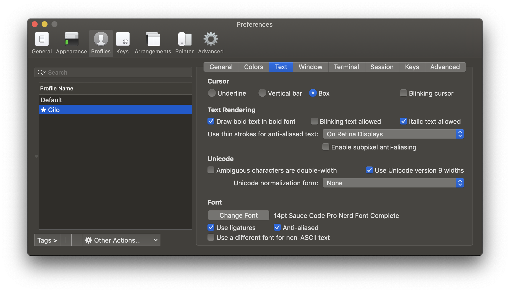

.. _iterm2:

iTerm2
======

`iTerm2 <http://www.iterm2.com/>`_ es un remplazo de la Terminal de Apple.

Instalación
-----------

Descarga la aplicación y arrastrala a la carpeta :file:`Applications`

======  =========================================================
⌘ D     divide la terminal verticalmente
⌘ ⇧ D   divide la terminal horizontalmente
⌘ ⌥ UP  cambia de terminal
⌘ /      resalta la posición del cursos
======  =========================================================

Python, Plone
-------------

Cuando iniciamos una instancia de Plone marca el error

.. code-block:: shell

    ValueError: unknown locale: UTF-8

Hay dos maneras de solucionar esto:

- agregar al archivo :file:`.bash_profile` o en el archivo :file:`.zshrc`

.. code-block:: shell

    # iTerm2 fix
    export LC_ALL=en_US.UTF-8
    export LANG=en_US.UTF-8

O en :menuselection:`Preferencias --> Perfil --> Terminal`  solicitar que no se asigne la variable de localización de manera automática (ver imagen) 

Ventanas y Pestañas
-------------------

En `iTerm2 <http://www.iterm2.com/>`_ podemos configurar en que directorio se abriran las nuevas ventanas o pestañas. 

.. image:: _static/working_directory.png
   :alt: iTerm2 (Locale)
   :width: 80%

.. image:: _static/working_directory_tabs_windows.png
   :alt: iTerm2 (Locale)
   :width: 80%

Módificaciones al PATH
----------------------

gettetx
~~~~~~~

Para agregar :command:`gettext` al path modificamos el archivo :file:`.zshrc`

.. code-block:: shell

    export PATH=/usr/local/opt/gettext/bin:$PATH

latex
~~~~~

.. code-block:: shell

   export PATH=$PATH:/Library/TeX/texbin/

Zsh
---

Cambiamos a `Zsh <https://www.zsh.org>`_ como shell default

.. code-block:: shell

   $ echo $SHELL
   $ chsh -s $(which zsh)

Salir de sesión y volver a entrar.

.. code-block:: shell

   $ echo $SHELL

Si queremos usar una version mas reciente de `Zsh <https://www.zsh.org>`_ podemos instalarla con :ref:`brew`

.. code-block:: shell

   $ brew install zsh

Usamos la versión Zsh de Homebrew

.. code-block:: shell

   $ chsh -s /usrl/local/bin/zsh

.. warning::

   En macOS Mojave no cambia y manda el siguiente mensaje: ``chsh: /usr/local/bin/zsh: non-standard shell``

Fuentes
-------

Source Code Pro
~~~~~~~~~~~~~~~

Intalamos la fuente `Source Code Pro <https://github.com/adobe-fonts/source-code-pro>`_ que es usada por algunos temas que se instalarán más adelante. Esta fuente tambien se usa en :ref:`sublimetext`

Despues de descargar el archivo seguimos las instrucciones generales en MacOS `How to install and remove fonts on your Mac <https://support.apple.com/en-us/HT201749>`_

Descomprimimos el archivo que descargamos y en el directorio :file:`OTF` y damos doble click a la fuente que queremos instalar.

Nerd Fonts
~~~~~~~~~~

`Nerd Fonts <http://nerdfonts.com>`_

Descargamos las fuentes y en el directorio :file:`SourceCodePro` damos doble click a la fuente que queremos instalar.

En la iTerm2 :menuselection:`Preferences --> Profiles --> Text` seleccionamos la fuente normal y la fuente para caractres non-ascii.

oh-my-zsh
---------

Instalamos `Oh My ZSH! <https://ohmyz.sh/>`_

.. code-block:: shell

    $ sh -c "$(curl -fsSL https://raw.github.com/robbyrussell/oh-my-zsh/master/tools/install.sh)"

Para actuzalizar a la ultima versión.

.. code-block:: shell

   $ upgrade_oh_my_zsh

Temas
-----

Editamos el archivo :file:`.zshrc` para definir el tema

.. code-block:: shell

    ZSH_THEME="agnoster"

Spaceship
~~~~~~~~~

`Spaceship ZSH <https://github.com/denysdovhan/spaceship-prompt>`_

copiamos el reposistorio:

.. code-block:: shell

   $ git clone https://github.com/denysdovhan/spaceship-prompt.git "$ZSH_CUSTOM/themes/spaceship-prompt"

Hacemos una liga simbolica :file:`spaceship.zsh-theme` al directorio de temas personalizados de `oh-my-zsh <https://ohmyz.sh/>`_

.. code-block:: shell

   $ ln -s "$ZSH_CUSTOM/themes/spaceship-prompt/spaceship.zsh-theme" "$ZSH_CUSTOM/themes/spaceship.zsh-theme"

En el archivo :file:`.zshrc` selccionamos el tema

.. code-block:: shell

   ZSH_THEME="spaceship"

Powerlevel9k
~~~~~~~~~~~~

.. warning::

   This may be removed

`powerlevel9k <https://github.com/bhilburn/powerlevel9k>`_

copiamos el reposistorio:

.. code-block:: shell

   $ git clone https://github.com/bhilburn/powerlevel9k.git "$ZSH_CUSTOM/themes/powerlevel9k"

Hacemos una liga simbolica :file:`spaceship.zsh-theme` al directorio de temas personalizados de `oh-my-zsh <https://ohmyz.sh/>`_

.. code-block:: shell

   $ ln -s "$ZSH_CUSTOM/themes/powerlevel9k/powerlevel9k.zsh-theme" "$ZSH_CUSTOM/themes/powerlevel9k.zsh-theme"

En el archivo :file:`.zshrc` selccionamos el tema

.. code-block:: shell

   ZSH_THEME="powerlevel9k"

Step-by-step installation

* Drop the cobalt2.zsh-theme file in to the ~/.oh-my-zsh/themes/ directory.
* Open up your ZSH preferences at ~/.zshrc and change the theme variable to ZSH_THEME="cobalt2".
* In iTerm2 access the Preferences pane on the Profiles tab.
* Under the Colors tab import the cobalt2.itermcolors file via the Load Presets drop-down.
* Under the Text tab change the font for each type (Regular and Non-ASCII) to 'Inconsolata for Powerline'. (Refer to the powerline-fonts repo for help on font installation.)
* Refresh ZSH by typing source ~/.zshrc on the command line.

git
~~~
it's what gives you tab completion for git

python
~~~~~~

zsh-syntax-highlighting
~~~~~~~~~~~~~~~~~~~~~~~
adds realtime syntax highlighting to commands while typed in the terminal

zsh-nvm
~~~~~~~
zsh plugin for Node Version Manager

Bibliografía
------------

* `What is ZSH, and Why Should You Use It Instead of Bash? <https://www.howtogeek.com/362409/what-is-zsh-and-why-should-you-use-it-instead-of-bash/>`_
* `You’re Missing Out on a Better Mac Terminal Experience <https://medium.com/@caulfieldOwen/youre-missing-out-on-a-better-mac-terminal-experience-d73647abf6d7>`_
* `My Terminal Setup: iTerm + Zsh <https://zen-of-programming.com/terminal-setup/>`_

* `Use Homebrew zsh Instead of the OS X Default <https://rick.cogley.info/post/use-homebrew-zsh-instead-of-the-osx-default/>`_
* `zsh <https://sourabhbajaj.com/mac-setup/iTerm/zsh.html>`_
* `Become A Command-Line Power User With Oh-My-ZSH And Z <https://www.smashingmagazine.com/2015/07/become-command-line-power-user-oh-my-zsh-z/>`_
* `Cobalt2 for iTerm2 and ZSH <https://github.com/wesbos/Cobalt2-iterm>`_
* `How to Customize your Terminal with ZSH <https://hackernoon.com/how-to-trick-out-terminal-287c0e93fce0>`_
* `Jazz Up Your ZSH Terminal In Seven Steps <https://medium.freecodecamp.org/jazz-up-your-zsh-terminal-in-seven-steps-a-visual-guide-e81a8fd59a38>`_
* `Faster and enjoyable ZSH (maybe) <https://htr3n.github.io/2018/07/faster-zsh/>`_
* `Fira Code: monospaced font with programming ligatures <https://github.com/tonsky/FiraCode>`_
