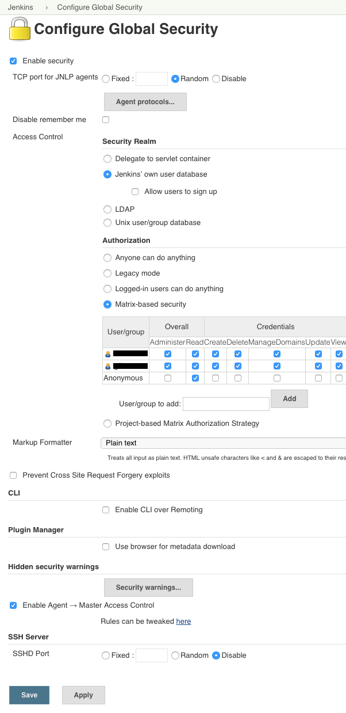

=======
Jenkins
=======

Jenkins Installation
====================

To use the Debian package repository of Jenkins to automate installation and 
upgrade, first add the key to your system:

.. code-block:: bash

    $ wget -q -O - http://pkg.jenkins-ci.org/debian/jenkins-ci.org.key | sudo apt-key add -

Then add the following entry in your `/etc/apt/sources.list`:

.. code-block:: bash

    deb http://pkg.jenkins-ci.org/debian binary/

Update your local package index, then finally install Jenkins:

.. code-block:: bash

    $ sudo apt-get update
    $ sudo apt-get install jenkins

* `/etc/default/jenkins` will capture configuration parameters for the launch.
* By default, Jenkins listen on port 8080. Access this port with your browser to start configuration.

Upgrade
=======

Once installed like this, you can update to the later version of Jenkins (when it comes out) by running the following commands:

.. code-block:: bash

    $ sudo apt-get update
    $ sudo apt-get install jenkins

Standard Security Setup
=======================

* Go to the Configure Global Security screen (http://server/jenkins/configureSecurity/) and choose "enable security"
* Select "Jenkins's own user database" as the security realm
* Place a check mark next to "Allow users to sign up"
* Select "Matrix-based security" as the authorization
* Give anonymous user the read access
* In the text box below the table, type in your user name (you'd be creating this later) and click "add"
* Give yourself a full access by checking the entire row for your user name
* Scroll all the way to the bottom, click "save"

At this point, you'll be taken back to the top page, and Jenkins is successfully secured.

Restart Jenkins

.. code-block:: bash

    $ sudo service jenkins restart

Now you need to create an user account for yourself. 

* Click "login" link at the top right portion of the page
* Choose "create an account"
* Use the user name you've used in the above step, and fill in the rest.
* If everything works smoothly, you are now logged on as yourself with full permissions

Plug-in's
=========

Para instalar nuevos plug-in’s en el Panel de control vamos a ‘Manage Jenkins - Manage Plugins’ y seleccionamos los necesarios. Para que tome los cambios hay que reiniciar el servidor.

`Green Balls <https://wiki.jenkins-ci.org/display/JENKINS/Green+Balls>`_
------------------------------------------------------------------------
Changes Hudson to use green balls instead of blue for successful builds.

`Workspace Cleanup <https://wiki.jenkins-ci.org/display/JENKINS/Workspace+Cleanup+Plugin>`_
--------------------------------------------------------------------------------------------
This plugin deletes the workspace before the build or when a build is finished and artifacts saved.
Option for deleting workspace before build is in Build Environment section:

`Cobertura Plugin <https://wiki.jenkins-ci.org/display/JENKINS/Cobertura+Plugin>`_
----------------------------------------------------------------------------------
This plugin allows you to capture code coverage report from Cobertura.

`Git Plugin <https://wiki.jenkins-ci.org/display/JENKINS/Git+Plugin>`_
----------------------------------------------------------------------

You may need to tell git who the user Jenkins is running as. 
To do this on a Linux/Unix system switch to that user which is probably `jenkins`.
Do this by using either of the following, which work even if the user is not supposed to have shell access:

.. code-block:: sh

    $ sudo su - -s /bin/bash jenkins

Now cd to the directory where the clone Jenkins created is and use `git config user.name` and `git config user.email` to set the values.

.. code-block:: sh

    $ cd /var/lib/jenkins/jobs/UNAM.imateCVct Plone 4.3/workspace
    $ git config user.email "some@email.com"
    $ git config user.name "jenkins"

`Warnings Plugin <https://wiki.jenkins-ci.org/display/JENKINS/Warnings+Plugin>`_
--------------------------------------------------------------------------------
This plugin generates the trend report for compiler warnings in the console log or in log files.

`Violations <https://wiki.jenkins-ci.org/display/JENKINS/Violations>`_
----------------------------------------------------------------------
This plug-in generates reports static code violation detectors such as checkstyle, pmd, cpd, findbugs, codenarc, fxcop, stylecop and simian.

`Static Code Analysis <https://wiki.jenkins-ci.org/display/JENKINS/Static+Code+Analysis+Plug-ins>`_
---------------------------------------------------------------------------------------------------
This plug-in provides utilities for the static code analysis plug-ins.

    Monitoring (crash on Mac 1.4) (M. Aspeli)
    Plot Plug-in (M. Aspeli)
    Dashboard View (M. Aspeli)
    ChuckNorris Plug-in (M. Aspeli)
    SetEnv Plug-in (rtyler Hudson labs)

Ubuntu Node
===========

`/usr/bin/env: node: No such file or directory`

I've found this is often a misnaming error, if you install from a package 
manager you bin may be called nodejs so you just need to symlink it like so
`ln -s /usr/bin/nodejs /usr/bin/node`

References
==========

`Jenkins Debian packages <http://pkg.jenkins-ci.org/debian/>`_

`Installing Jenkins on Ubuntu <https://wiki.jenkins-ci.org/display/JENKINS/Installing+Jenkins+on+Ubuntu>`_

`Standard Security Setup <https://wiki.jenkins-ci.org/display/JENKINS/Standard+Security+Setup>`_

`Jenkins buildout for PLONE projects <https://buildoutjenkins.readthedocs.org/en/latest/index.html>`_

`Git Plugin <https://wiki.jenkins-ci.org/display/JENKINS/Git+Plugin>`_

`Violations plugin <https://wiki.jenkins-ci.org/display/JENKINS/Violations>`_

`Warnings Plugin <https://wiki.jenkins-ci.org/display/JENKINS/Warnings+Plugin>`_