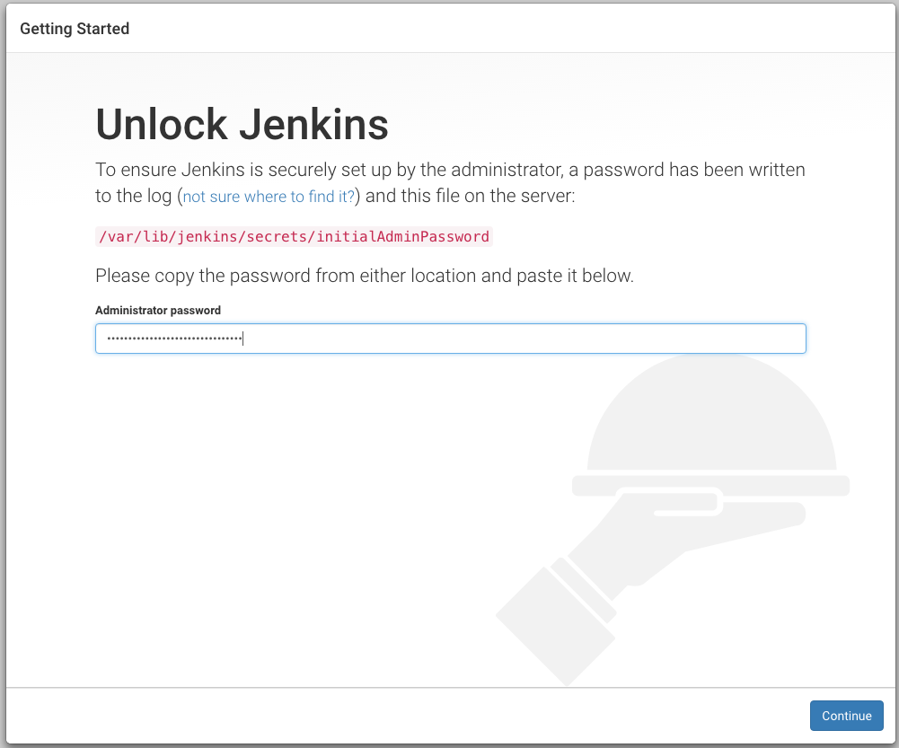
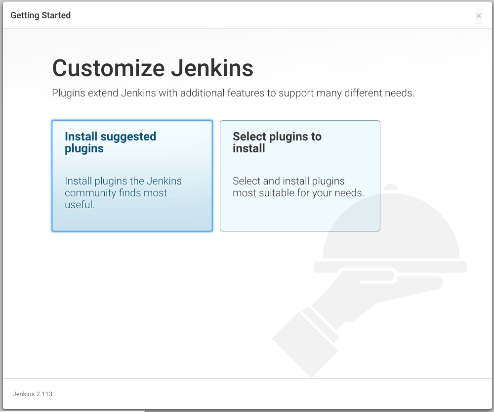
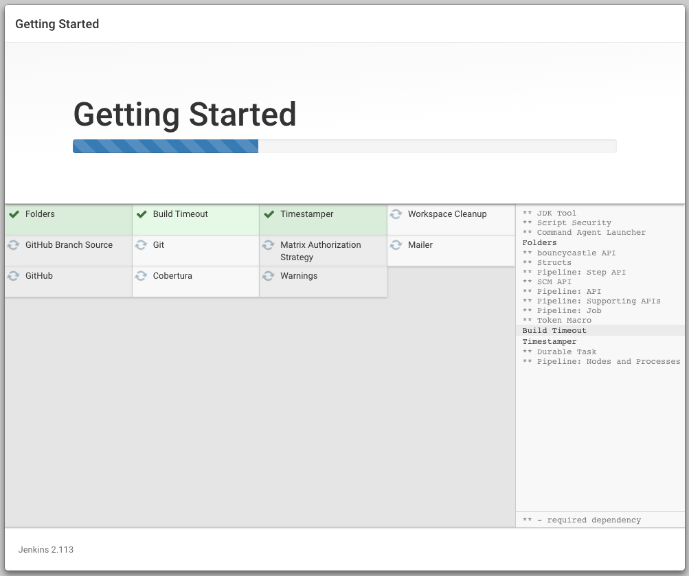
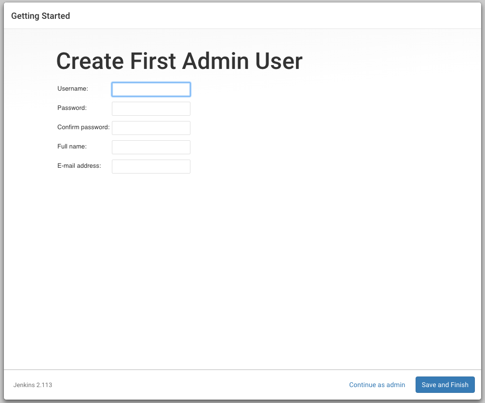
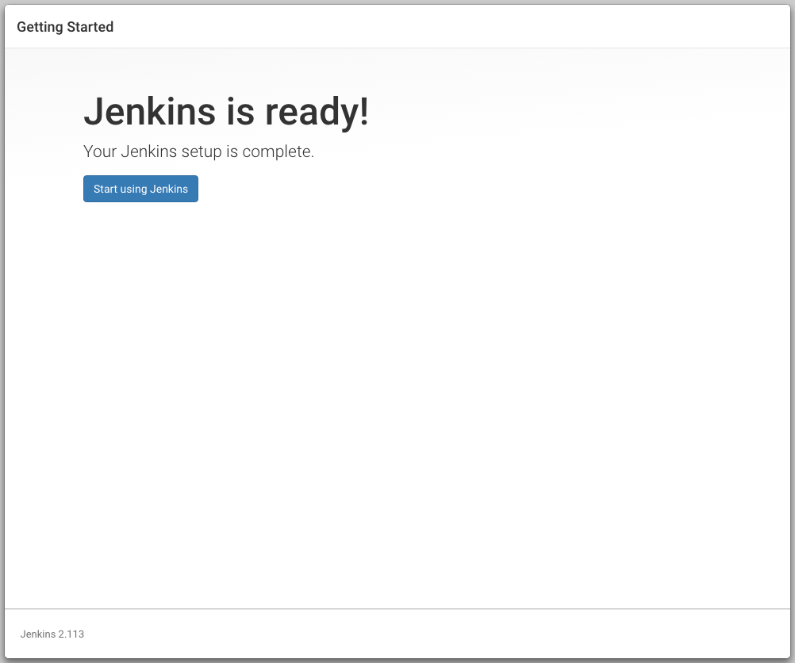

=======
Jenkins
=======

Instalación
===========

To use the Debian package repository of Jenkins to automate installation and upgrade, first add the key to your system:

.. code-block:: shell

    $ wget -q -O - https://pkg.jenkins.io/debian/jenkins.io.key | sudo apt-key add -
    $ sudo sh -c 'echo deb http://pkg.jenkins.io/debian-stable binary/ > /etc/apt/sources.list.d/jenkins.list'
    $ sudo apt-get update
    $ sudo apt-get install jenkins

This package installation will:

* Setup Jenkins as a daemon launched on start. See :file:`/etc/init.d/jenkins` for more details.
* Create a ``jenkins`` user to run this service.
* Direct console log output to the file :file:`/var/log/jenkins/jenkins.log`. Check this file if you are troubleshooting Jenkins.
* Populate :file:`/etc/default/jenkins` with configuration parameters for the launch, e.g ``JENKINS_HOME``
* By default, Jenkins listen on port 8080. Access this port with your browser to start configuration.

.. note::

  Para cambiar el puerto modificamos en el archivo :file:`/etc/default/jenkins` el valor de ``HTTP_PORT``

Actualización
=============

Once installed like this, you can update to the later version of Jenkins (when it comes out) by running the following commands:

.. code-block:: shell

    $ sudo apt-get update
    $ sudo apt-get install jenkins

Configuración
=============

Standard Security Setup
=======================

* Go to the Configure Global Security screen (http://server/jenkins/configureSecurity/) and choose "enable security"
* Select "Jenkins's own user database" as the security realm
* Place a check mark next to "Allow users to sign up"
* Select "Matrix-based security" as the authorization
* Give anonymous user the read access
* In the text box below the table, type in your user name (you'd be creating this later) and click "add"
* Give yourself a full access by checking the entire row for your user name
* Scroll all the way to the bottom, click "save"

.. image:: gsecurity.png

At this point, you'll be taken back to the top page, and Jenkins is successfully secured.

Restart Jenkins

.. code-block:: shell

    $ sudo service jenkins restart

Now you need to create an user account for yourself.

* Click "login" link at the top right portion of the page
* Choose "create an account"
* Use the user name you've used in the above step, and fill in the rest.
* If everything works smoothly, you are now logged on as yourself with full permissions

Remove the:

* Place a check mark next to "Allow users to sign up"

Plug-in's
=========

Para instalar nuevos plug-in’s en el Panel de control vamos a ‘Manage Jenkins - Manage Plugins’ y seleccionamos los necesarios. Para que tome los cambios hay que reiniciar el servidor.

`Green Balls <https://wiki.jenkins-ci.org/display/JENKINS/Green+Balls>`_
------------------------------------------------------------------------
Changes Hudson to use green balls instead of blue for successful builds.

`Workspace Cleanup <https://wiki.jenkins-ci.org/display/JENKINS/Workspace+Cleanup+Plugin>`_
--------------------------------------------------------------------------------------------
This plugin deletes the workspace before the build or when a build is finished and artifacts saved.
Option for deleting workspace before build is in Build Environment section:

`Cobertura Plugin <https://wiki.jenkins-ci.org/display/JENKINS/Cobertura+Plugin>`_
----------------------------------------------------------------------------------
This plugin allows you to capture code coverage report from Cobertura.

`Git Plugin <https://wiki.jenkins-ci.org/display/JENKINS/Git+Plugin>`_
----------------------------------------------------------------------

You may need to tell git who the user Jenkins is running as.
To do this on a Linux/Unix system switch to that user which is probably `jenkins`.
Do this by using either of the following, which work even if the user is not supposed to have shell access:

.. code-block:: shell

    $ sudo su - -s /bin/bash jenkins

Now cd to the directory where the clone Jenkins created is and use `git config user.name` and `git config user.email` to set the values.

.. code-block:: shell

    $ cd /var/lib/jenkins
    $ git config user.email "some@email.com"
    $ git config user.name "jenkins"

La llave privada y publica, para clonar de `github <https://github.com>`_ con ssh, se debe guardar en:

.. code-block:: shell

    /var/lib/jenkins/.ssh

y debe estar registrada en `github <https://github.com>`_:

para generar una nueva llave leer `Generating an SSH key <https://help.github.com/articles/generating-an-ssh-key/>`_.

Si se opta por usar HTTPS,  podemos almacenar la llave en un cache tempral:

.. code-block:: shell

    $ git config --global credential.helper cache

o por mas tiempo (el default es ~/.git-credentials)

.. code-block:: shell

    git config --global credential.helper 'store --file ~/.my-credentials'

`Warnings Plugin <https://wiki.jenkins-ci.org/display/JENKINS/Warnings+Plugin>`_
--------------------------------------------------------------------------------
This plugin generates the trend report for compiler warnings in the console log or in log files.

`Violations <https://wiki.jenkins-ci.org/display/JENKINS/Violations>`_
----------------------------------------------------------------------
This plug-in generates reports static code violation detectors such as checkstyle, pmd, cpd, findbugs, codenarc, fxcop, stylecop and simian.

`Static Code Analysis <https://wiki.jenkins-ci.org/display/JENKINS/Static+Code+Analysis+Plug-ins>`_
---------------------------------------------------------------------------------------------------
This plug-in provides utilities for the static code analysis plug-ins.

    Monitoring (crash on Mac 1.4) (M. Aspeli)
    Plot Plug-in (M. Aspeli)
    Dashboard View (M. Aspeli)
    ChuckNorris Plug-in (M. Aspeli)
    SetEnv Plug-in (rtyler Hudson labs)

Node
====
.. code-block:: shell

    /usr/bin/env: node: No such file or directory

I've found this is often a misnaming error, if you install from a package 
manager you bin may be called nodejs so you just need to symlink it like so::

    ln -s /usr/bin/nodejs /usr/bin/node

Nginx
=====

Editamos `/etc/default/jenkins`

Asignamos valores para:

* $HTTP_PORT
* $PREFIX
* $HTTP_HOST

.. code-block:: shell

    JENKINS_ARGS="--webroot=/var/cache/$NAME/war --httpPort=$HTTP_PORT --prefix=$PREFIX --httpListenAddress=127.0.0.1"

Reiniciamos Jenkins::

    $ sudo service jenkins restart

El archivo de nginx `/etc/nginx/sites-enabled/jenkins` debe ser algo similar a:

.. code-block:: nginx

    server {

        listen 80;
        server_name domain.tld;

        # Nginx configuration specific to Jenkins
        # In addition, you must ensure that Jenkins is configured to listen for requests to the /jenkins/ folder
        # Do that by adding the parameter --prefix=/jenkins to the Jenkins default start-up configuration file
        # the configuration file is /etc/default/jenkins
        # Note that regex takes precedence, so use of "^~" ensures earlier evaluation
        location ^~ /jenkins/ {

          proxy_set_header        Host $host:$server_port;
          proxy_set_header        X-Real-IP $remote_addr;
          proxy_set_header        X-Forwarded-For $proxy_add_x_forwarded_for;
          proxy_set_header        X-Forwarded-Proto $scheme;

          # Fix the "It appears that your reverse proxy set up is broken" error.
          # Convert inbound WAN requests for https://domain.tld/jenkins/ to
          # local network requests for http://127.0.0.1:8080/jenkins/
          proxy_pass          http://127.0.0.1:8080/jenkins/;
          proxy_read_timeout  90;

          #proxy_redirect      http://127.0.0.1:8080 http://domain.tld;

          # Required for new HTTP-based CLI
          proxy_http_version 1.1;
          proxy_request_buffering off;
        }
    }

Reiniciamos NginX::

    $ sudo service nginx reload

Plone
=====

Podemos crea un directorio para guardar los paquetes descargados:

.. code-block:: shell

    $ sudo su - -s /bin/bash jenkins
    $ mkdir .buildout
    $ cd .buildout/
    $ mkdir downloads eggs extends
    $ echo -e "[buildout]\neggs-directory = /var/lib/jenkins/.buildout/eggs\ndownload-cache = /var/lib/jenkins/.buildout/downloads\nextends-cache = /var/lib/jenkins/.buildout/extends\n" > default.cfg

Desinstalar Jenknins
====================

.. code-block:: shell

    $ sudo apt-get remove --purge jenkins

References
==========

`Jenkins Debian packages <https://pkg.jenkins.io/debian-stable/>`_

`How To Install Java with AptGet on Debian 8 <https://www.digitalocean.com/community/tutorials/how-to-install-java-with-apt-get-on-debian-8>`_

`Jenkins behind an NGinX reverse proxy <https://wiki.jenkins-ci.org/display/JENKINS/Jenkins+behind+an+NGinX+reverse+proxy>`_

`Standard Security Setup <https://wiki.jenkins-ci.org/display/JENKINS/Standard+Security+Setup>`_

`Jenkins buildout for PLONE projects <https://buildoutjenkins.readthedocs.org/en/latest/index.html>`_

`Git Plugin <https://wiki.jenkins-ci.org/display/JENKINS/Git+Plugin>`_

`Violations plugin <https://wiki.jenkins-ci.org/display/JENKINS/Violations>`_

`Warnings Plugin <https://wiki.jenkins-ci.org/display/JENKINS/Warnings+Plugin>`_

`Git Tools - Credential Storage <https://git-scm.com/book/en/v2/Git-Tools-Credential-Storage>`_